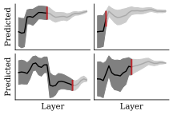

# COMET-early-exit

[](TODO)
&nbsp;
[](https://huggingface.co/collections/zouharvi/comet-early-exit-67b5fc5db24bf87803cdb346)

This repository contains code for the paper [Early-Exit and Instant Confidence Translation Quality Estimation](TODO) by Vilém Zouhar, Maike Züfle, Beni Egressy, Julius Cheng, Jan Niehues.

> **Abstract:** 
> Quality estimation is omnipresent in machine translation, for both evaluation and generation.
> Unfortunately, quality estimation models are often opaque and computationally expensive, making them impractical to be part of large-scale pipelines.
> In this work, we tackle two connected challenges:
> (1) reducing the cost of quality estimation at scale, and (2) developing an inexpensive uncertainty estimation method for quality estimation.
> To address the latter, we introduce Instant Confidence COMET, an uncertainty-aware quality estimation model that matches the performance of previous
> approaches at a fraction of their costs.
> We extend this to Early-Exit COMET, a quality estimation model that can compute quality scores and associated confidences already at early model layers, allowing us to early-exit computations and reduce evaluation costs.
> We also apply our model to machine translation reranking.
> We combine Early-Exit COMET with an upper confidence bound bandit algorithm to find the best candidate from a large pool without having to run the full evaluation model on all candidates.
> In both cases (evaluation and reranking) our methods reduce the required compute by 50% with very little degradation in performance.



## Running pre-trained models

The implementation for the various COMET models is kept in [comet_early_exit](comet_early_exit).
To run our models, you need to first install this version of COMET either with:
```bash
pip install "git+https://github.com/zouharvi/COMET-early-exit#egg=comet-early-exit&subdirectory=comet_early_exit"
```
or in editable mode:
```bash
git clone https://github.com/zouharvi/COMET-early-exit.git
cd COMET-early-exit
pip3 install -e comet_early_exit
```

Then, this package can be used in Python with `comet_early_exit` package.
The package name changed intentionally from Unbabel's package name such that they are not mutually exclusive.
```python
import comet_early_exit
model = comet_early_exit.load_from_checkpoint(comet_early_exit.download_model("zouharvi/COMET-instant-confidence"))
```

We offer three public models on HuggingFace: [COMET-instant-confidence](https://huggingface.co/zouharvi/COMET-instant-confidence), [COMET-instant-self-confidence](https://huggingface.co/zouharvi/COMET-instant-self-confidence), and [COMET-partial](https://huggingface.co/zouharvi/COMET-partial) train in various regimes on direct assessment up to WMT2022.
All models are reference-less, requiring only the source and the translation.
The following snippets are taken from [experiments/56-test_models_readme.py](experiments/56-test_models_readme.py).

### COMET-instant-confidence

Behaves like standard quality estimation, but outputs two numbers: `scores` (as usual) and `confidences`, which is the estimated absolute error from the human score.
Thus, contrary to expectations, higher "confidence" correponds to less correct QE estimation.
```python
model = comet_early_exit.load_from_checkpoint(comet_early_exit.download_model("zouharvi/COMET-instant-confidence"))
data = [
    {
        "src": "Can I receive my food in 10 to 15 minutes?",
        "mt": "Moh bych obdržet jídlo v 10 do 15 minut?",
    },
    {
        "src": "Can I receive my food in 10 to 15 minutes?",
        "mt": "Mohl bych dostat jídlo během 10 či 15 minut?",
    }
]
model_output = model.predict(data, batch_size=8, gpus=1)
print("scores", model_output["scores"])
print("estimated errors", model_output["confidences"])

assert len(model_output["scores"]) == 2 and len(model_output["confidences"]) == 2
```
Outputs (formatted):
```
scores            72.71  88.56
estimated errors  15.63   9.74
```

### COMET-instant-self-confidence

This model makes prediction at each of the 25 layers, both the score and the confidence.
This time, the confidence is the absolute error with respect to the final layer's prediction.
```python
model = comet_early_exit.load_from_checkpoint(comet_early_exit.download_model("zouharvi/COMET-instant-self-confidence"))
data = [
    {
        "src": "Can I receive my food in 10 to 15 minutes?",
        "mt": "Moh bych obdržet jídlo v 10 do 15 minut?",
    },
    {
        "src": "Can I receive my food in 10 to 15 minutes?",
        "mt": "Mohl bych dostat jídlo během 10 či 15 minut?",
    }
]
model_output = model.predict(data, batch_size=8, gpus=1)

# print predictions at 5th, 12th, and last layer
print("scores", model_output["scores"][0][5], model_output["scores"][0][12], model_output["scores"][0][-1])
print("estimated errors", model_output["confidences"][0][5], model_output["confidences"][0][12], model_output["confidences"][0][-1])

# two top-level outputs
assert len(model_output["scores"]) == 2 and len(model_output["confidences"]) == 2
# each output contains prediction per each layer
assert all(len(l) == 25 for l in model_output["scores"]) and all(len(l) == 25 for l in model_output["confidences"])
```
Outputs (formatted):
```
scores            75.60  86.60  85.74
estimated errors  10.48   3.52   0.83
```

### COMET-partial

This model is described in the appendix in the paper.
It is able to score even *incomplete* translations (i.e. prefixes of translations):
```python
model = comet_early_exit.load_from_checkpoint(comet_early_exit.download_model("zouharvi/COMET-partial"))
data = [
    {
        "src": "Can I receive my food in 10 to 15 minutes?",
        "mt": "Mohl bych",
    },
    {
        "src": "Can I receive my food in 10 to 15 minutes?",
        "mt": "Mohl bych dostat jídlo",
    },
    {
        "src": "Can I receive my food in 10 to 15 minutes?",
        "mt": "Mohl bych dostat jídlo během 10 či 15 minut?",
    }
]
model_output = model.predict(data, batch_size=8, gpus=1)
print("scores", model_output["scores"])
```
Outputs (formatted):
```
scores 89.18  86.52  89.20
```


## Replicating experiments in the paper

The [experiments/](experiments) directory contains scripts to run the experiments.
This is intentionally separate from the [comet_early_exit/](comet_early_exit/) package, which is a fork of [Unbabel's COMET](https://github.com/Unbabel/COMET/) from version 2.2.4.
For training your own models, as described in the paper, please see [experiments/04-launch_comet.sh](experiments/04-launch_comet.sh).

Description of plotting and other experiments is WIP.

## Replicating reranking experiments in the paper
The [experiments_reranking/](experiments_reranking) directory contains scripts to run the reranking experiments.

### Download data 
The data can be obtained by using scripts from the  [experiments/](experiments) directory:
```
cd experiments
bash 01-get_data.sh  # download data
python 02-get_da_data.py # prepare data
```
The data will be downloaded to `experiments/data/`. 
### Generate candidates

```
cd ../experiments_reranking
python scripts/generate_candidates.py <data_dir> test <output_dir> --generation_mode sample --max_batch_size 50
```
Replace the data and output directory to your needs. Candidates can also be obtained using beam search, to do so, use `beam` as a generation mode instead of `sample`. 

Candidates can then be scored using the following script: 


```
python scripts/score_comet_layerwise.py <data_dir> test <output_dir> --comet_path "zouharvi/COMET-instant-self-confidence" --generation_mode sample
```

### Run bandit algorithm
Finally, the bandit can be run in the following way: 
```
python scripts/bandit.py <data_dir> test <output_dir> COMET-instant-self-confidence --use_confidences --norm_confidences --generation_mode sample --start_layer_ablation --ucb_ablation
```


## Citation

```
@misc{zouhar2025earlyexit,
      title={Early-Exit and Instant Confidence Translation Quality Estimation}, 
      author={Vilém Zouhar and Maike Züfle and Beni Egressy and Julius Cheng and Jan Niehues},
      year={2025},
      eprint={TODO},
      archivePrefix={arXiv},
      primaryClass={cs.CL},
      url={TODO},
}
```
